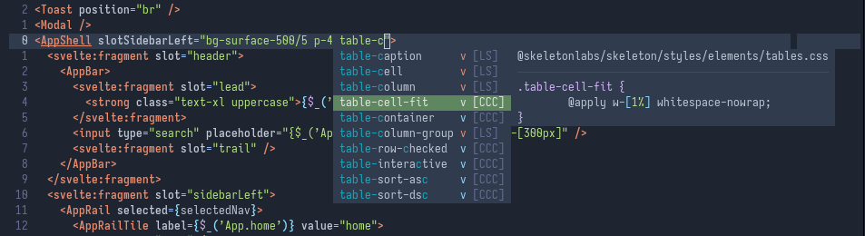

# Vim/Neovim CoC CSS class selectors completion plugin

`coc-class-css` [CoC](https://github.com/neoclide/coc.nvim) is an autocompletion plugin of CSS/PostCSS/SCSS
classes in HTML like markup.



All you need is to configure root css files to start from.

## Requirements

* CoC vim plugin `v0.0.80+`
* [Watchman](https://facebook.github.io/watchman/) installed in order to update completion index when files changed.

## Installation

```
:CocInstall coc-class-css
```

## Configuration

### Recommended way

Place a `.coc-class-css.json` file alongside of your `package.json` like this:

```json
{
  "cssRoots": ["./src/index.css"],
  "classAttributes": ["class"]
}
```

Where `cocRoots` specifies css files to process. Local `@import` directives are supported as well.

### CoC configuration options.

* `coc-class-css.languages` List of file types for which this plugin will be activated.
   Default: `["html", "svelte", "vue", "javascriptreact"]`
* `coc-class-css.cssRoots` Initial set of css files.
* `coc-class-css.classAttributes` List of `class`  like HTML attributes to trigger autocompletion. Default: `["class"]`
   Note: `tailwindCSS.classAttributes` is also taken into account.

## Tips

For correct autocompletion for keywords with dashes it also recommended to setup `b:coc_additional_keywords`

```vimscript
autocmd FileType * let b:coc_additional_keywords = ["-"]
```